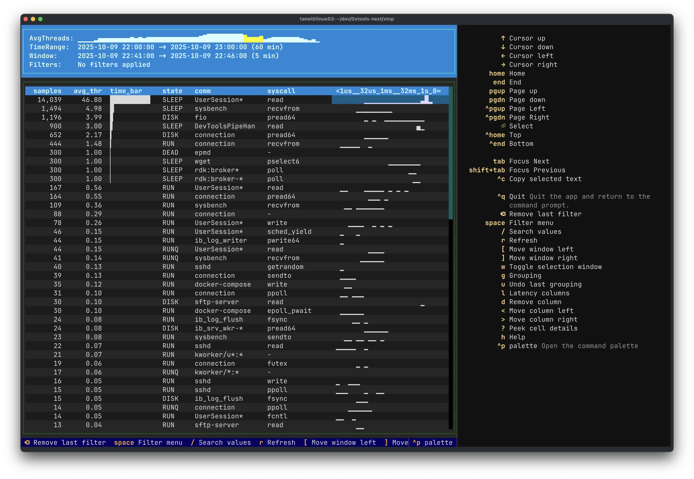

## xCapture v3.0.3
_By Tanel Poder_
_2025-10-23_

This is the first ever release of [0x.tools](https://0x.tools) xCapture tool that is built with **modern eBPF**! My previous tools and prototypes were using either _bcc_, _bpftrace_ or were just sampling and aggregating thread level info from _/proc_ files.

* [Announcing xCapture v3: Linux Performance Analysis with Modern eBPF and DuckDB](https://tanelpoder.com/posts/xcapture-v3-alpha-ebpf-performance-analysis-with-duckdb/)
* [xtop: Dimensional Performance Analysis of Sampled Thread Activity](https://tanelpoder.com/posts/xcapture-xtop-beta/)



## Requirements

Modern eBPF means `libbpf`, `CORE`, `BTF`, `BPF iterators`, etc. I'll write about my learning journey with proper thank you notes soon.

In practice this means you'll need to be on a **Linux kernel 5.11** or up (eBPF _task storage_). xCapture v3 is a future-facing tool, so I'll invest the time in that direction and not worry about all the legacy systems out there (unlike my approach was with all my previous tools was).

This means, RHEL9+ on Linux 5.14, or Oracle Enterprise Linux 8+, as long as you run at least their UEK7 Linux kernel (5.15). Ubuntu has pretty new kernels (and they have the HWE versions), so Ubuntu 20+ with the latest HWE kernel available for it should work. I have done my latest tests on Ubuntu 24.04 on Linux 6.8 though (will keep you updated once I test more).

_Currently you'd have to be either on a RHEL9 5.14+ kernel or 5.18+ otherwise (for all functionality). RedHat backported 6.8 eBPF functionality to their 5.14 kernel (RHEL 9.5 onwards). For older kernels without such backports, notably 5.15 used by Oracle UEK7 kernel and older Ubuntu, use "make old" to build the limited xcapture version._

## Building xcapture v3

```
git clone https://github.com/tanelpoder/0xtools.git
cd 0xtools
```

Install required system packages for compiling the binary:

On Ubuntu 20.04+ with HWE kernel 5.15+:

```
sudo apt install make gcc pkg-config libbpf-dev libbpf-tools clang llvm libbfd-dev libelf1 libelf-dev zlib1g-dev
```

On RHEL9 with RHEL 5.14+ kernel (with RedHat backports):

```
sudo dnf install libbpf libbpf-tools clang llvm-devel binutils-devel elfutils-libelf elfutils-libelf-devel zlib-devel
```

To install required libbpf dependencies for the GitHub repo, run:

```
git submodule update --init --recursive
```

## Running xcapture in developer mode

By default, xcapture prints some of its fields as formatted output to your terminal screen:

```
cd xcapture
make
sudo build/xcapture
```

The "always-on" production mode for appending samples to hourly CSV files is enabled by the `-o DIRNAME` option. You can use `-o .` to output to your current directory.

> While XCapture requires root privileges to load its eBPF programs and do its sampling, the consumers of the output CSV files **do not have to be root**! They can be any regular user who has the Unix filesystem permissions to read the output directory and CSV files. This provides a nice separation of duties. And you can analyze the "dimensional data warehouse" of Linux thread activity from any angle _you_ want, without having to update or change XCapture itself.

You can also run `xcapture --help` to get some idea of its current functionality.

**NB!** While all the syscall & IO _tracking_ action happens automatically in the kernel space, the simulatneous _sampling_ of the tracked events is driven by the userspace `xcapture` program. The thread state sampling loop actually runs completely inside the kernel too, thanks to eBPF _task iterators_, but the invocation and frequency of the sampling is driven by the userspace program.

Therefore it makes sense to schedule the userspace "sampling driver" with a high scheduling priority, to get consistently reoccurring samples from it. I run it like this and recommend that you do too:

```
cd build
sudo TZ=:/etc/localtime chrt -r 30 xcapture -vo DIRNAME
```

The `chrt` puts the userspace xcapture program into real-time scheduling class. It's a single, single-threaded prodess and you'll only need to run only one in the host and it can monitor all threads in the system. By default it wakes up once per second and tells the eBPF task iterator to do its sampling, gets results via an eBPF ringbuf and writes the records either to STDOUT or CSV files.

The entire sampling loop itself is very quick, from ~100us in my laptop VMs, to ~20ms per wakeup in a large NUMA machine with 384 CPUs. So, XCapture _passive sampling_ at 1Hz without _active tracking_ of event latencies has only taken between 0.01% and 2% _**of a single CPU**__ in my servers! (The _2% of-a-single-CPU_ result is from my AMD EPYC server with 384 CPUs :-)

The `TZ:=/etc/localtime` setting gives you two things:

1) You can choose your own human wall-clock timezone in which to print out various timestamps. You can set `TZ=` (to empty value) to get times in UTC. The kernel and eBPF programs don't deal with human time internally, the CLOCK\_MONOTONIC clock-source I'm using is just stored as number of nanoseconds from some arbitrary point in the past.
2) The timezone environment variable also reduces `xcapture` userspace CPU usage, as otherwise it would go and check some `/etc/localtimezone` file or something like that on every `snprintf()` library call.


## xtop and demo workload files
If you want to run `xtop`, install python dependencies to your personal virtual environment (or use `uv` or `pipx`):

```
. .venv/bin/activate # change to where your venv is
pip install duckdb textual

cd xtop
export TERM=xterm-256color
export XCAPTURE_DATADIR=demo # demo workload files under xtop/demo
./xtop

```

## That's all!

Follow the news and developments at my blog [tanelpoder.com](https://tanelpoder.com)

